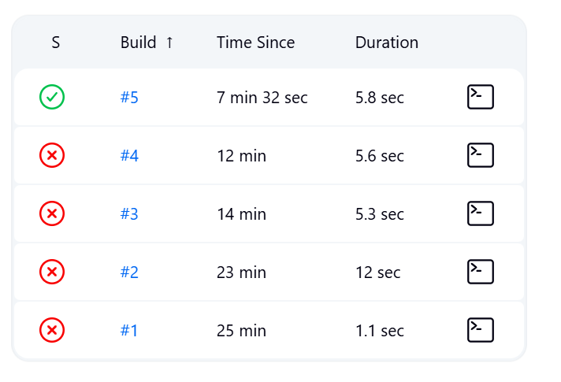
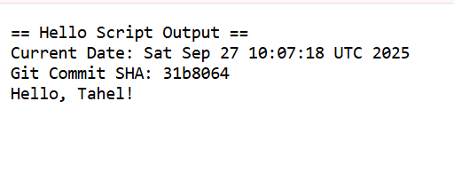
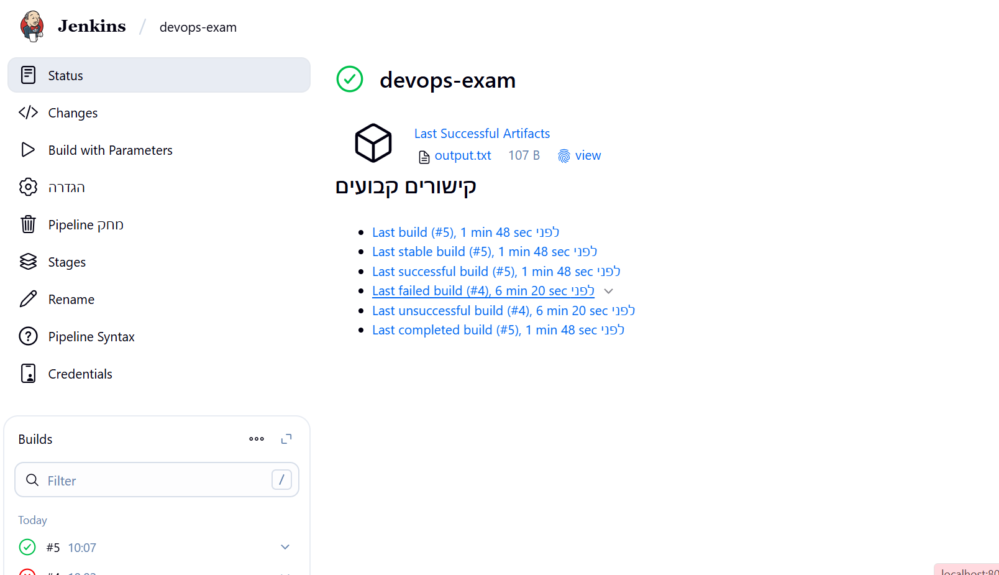

# DevOps Exam Project

## Repository URL
https://github.com/TahelAbudi/Devops_Exam.git

## Docker Setup
Used this command to start Jenkins:
`docker run -d --name jenkins -p 8080:8080 -p 50000:50000 -v jenkins_home:/var/jenkins_home jenkins/jenkins:lts`

The volume `jenkins_home` keeps all Jenkins data when container restarts.

## Credentials handling
- Got initial password with: `docker exec jenkins cat /var/jenkins_home/secrets/initialAdminPassword`  
- Installed suggested plugins
- Created admin user via web interface

## Files
- `Jenkinsfile` - pipeline config
- `scripts/hello.sh` - bash script that prints date + git info
- `README.md` - this file
- `.gitignore` - standard git ignore

## How it works
Pipeline takes a NAME parameter (default "World"), runs the hello script, and saves output to artifact.
- The script uses `set -euo pipefail` for error handling as required.

## Screenshots
# Jenkins Build History with Successful Run

# Archived Artifact (output.txt) in Jenkins

# Jenkins Successful Build

## Questions and Answers
1. If you kill the Jenkins container, what command do you use to start it again with the same configuration?
   `docker start jenkins` - use docker start with the container name. All the settings stay because we gave it a name and used a volume
2. Explain briefly why Jenkins preserves its state after restart?
   The volume jenkins_home saves everything to the computer, not just in the container. 
   So when Jenkins starts again it finds all the old data still there.
   
## Files Description
- Jenkinsfile: Defines the Jenkins pipeline with stages for checkout, script execution, and archiving
- scripts/hello.sh: Bash script that prints date, Git SHA, and greeting message
- README.md: Project documentation
- .gitignore: Excludes temporary and build files from Git

## Requirements
- Jenkins with Pipeline plugin
- Bash environment
- Git integration

## Bonus Task
For the bonus task, I set up a Jenkins agent that runs in its own Docker container.

## What I did
- Created a custom Docker network so the controller and agent could communicate.
- Restarted the Jenkins controller inside this network.
- Added a new node in Jenkins (`linux-docker-1`) with the label `linux-docker-extra` and copied its secret.
- Started the agent container using the official `jenkins/inbound-agent` image and connected it to the controller with the secret.
- Configured the pipeline to run only on this label.

# Result:
Two containers are running (controller + agent), the node shows as online in Jenkins, and the pipeline executes successfully on the agent and archives the output.

## Bonus screenshots
# Docker ps Result - Two Containers Running

# Jenkins Nodes - Agent Connected  

# Pipeline Running on Agent
